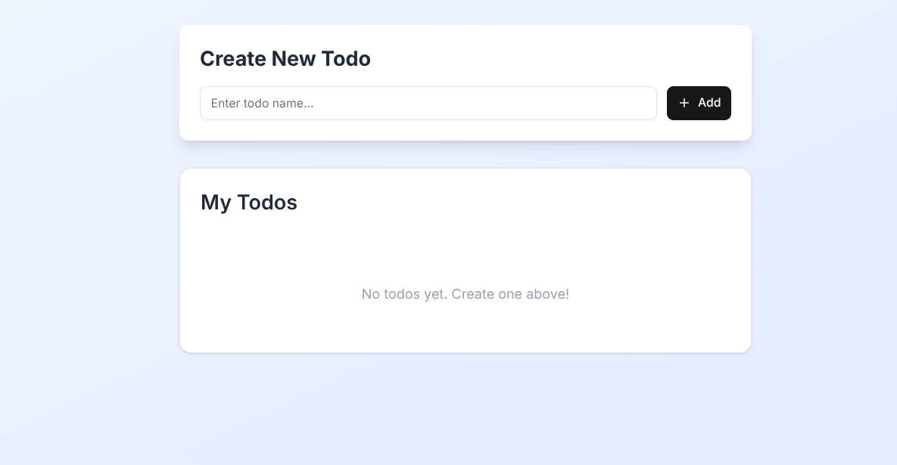
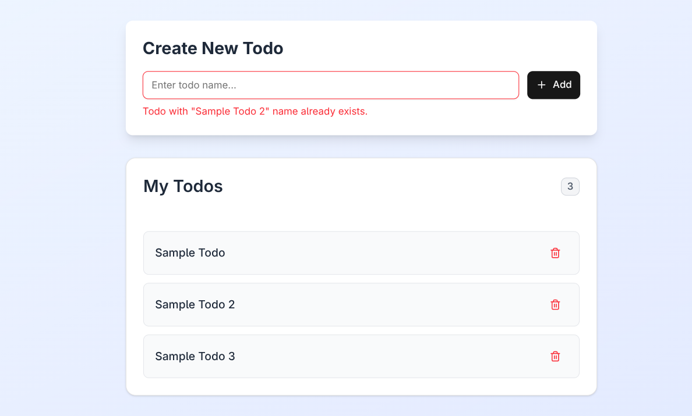
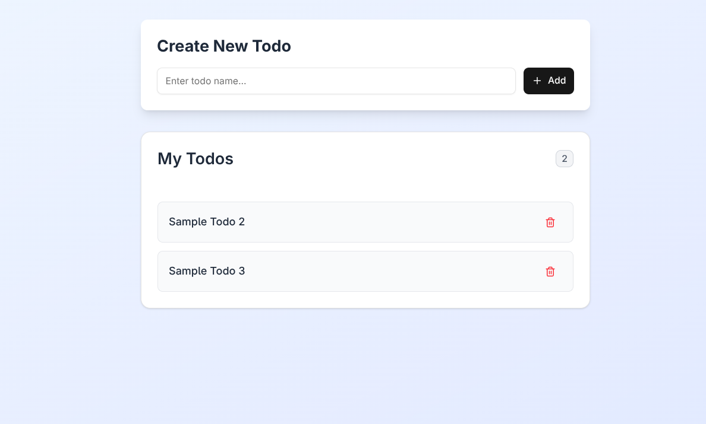
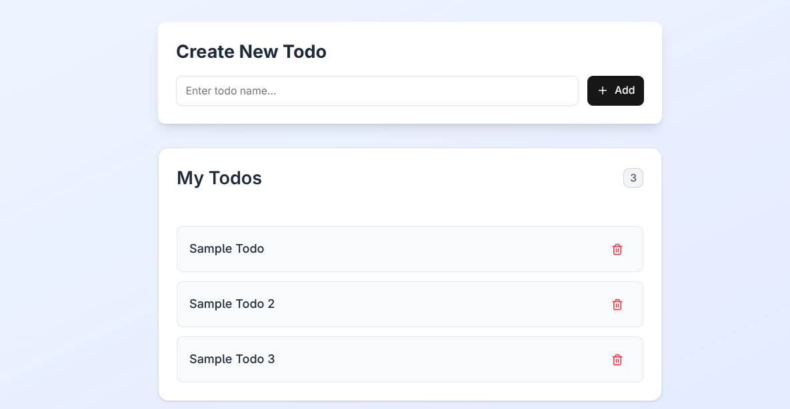

# Todo App

A simple todo application built with Next.js, Tailwind CSS, Shadcn UI, and Zustand.


## Features

### Add new todos


### Duplicate prevention



### Delete todos



### Todo counter

**Before deletion** todo count?



**After deletion** todo count?


## Tech Stack

- Next.js (React)
- Tailwind CSS
- Shadcn UI
- Zustand (state management)

## Getting Started

Install dependencies:

```bash
npm install
```

Run the development server:

```bash
npm run dev
```

Open [http://localhost:3000](http://localhost:3000) in your browser.

## Usage

- Type a todo name and click "Add" to create a new todo
- Click the trash icon to delete a todo
- Duplicate todo names are not allowed
